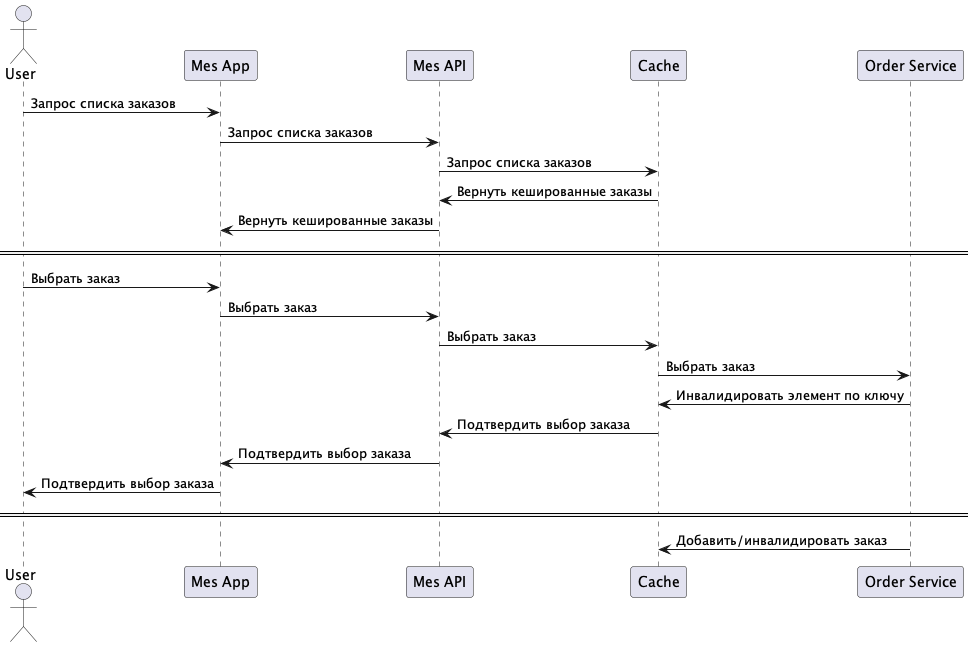

# Архитектурное решение по кешированию

## Мотивация

Отображение списка заказов в MES просиходит с большими задержками в связи с большой нагрузкой на хранилище. Подсистема MES API получает из Shop DB через промежуточные звенья список не распределенных заказов. Такой запрос являтся достаточно сложным и вызывает задержки, усложняющие работу операторов производителей. Требуется обеспечить выполнение указанного запроса с задержкой не более 1 секунды.

## Предлагаемое решение

Предлагается на уровне MES API обеспечить серверное кэширование. Данный вариант (в отличие от клиентского кэширования) обеспечит равную актуальность информации для всех пользователей MES API.

### Паттерн кеширования

Из паттернов серверного кеширования (Cache-Aside, Write-Through, Refresh-Ahead) предлагается выбрать Refresh-Ahead. Такой вариант представляется наиболее эффективным в условиях, когда предполагается, что каждый заказ будет отправлен исполнителю в короткое время после размещения. Таким образом представляется целесообразным поддерживать актуальный список заказо в кеше по расписанию по инициативе сервера.

### Диаграмма последовательности (Sequence diagram)
Добавьте диаграмму последовательности для операций:

### Стратегия инвалидации кеша
В качестве стратегии инвалидации кэша из вариантов "Временная инвалидация", "Инвалидация по ключу", "Программная инвалидация" предлагается выбрать "Инвалидацию по ключу". С учетом логики программы, когда производитель выбирает из свободных заказов один конкретный заказ, и заказ остается свободным до того как его выберут или отменят, не зависимо от других заказов, такой способ инвалидации представляется наиболее точно вписывающимся в логику работы программы.
